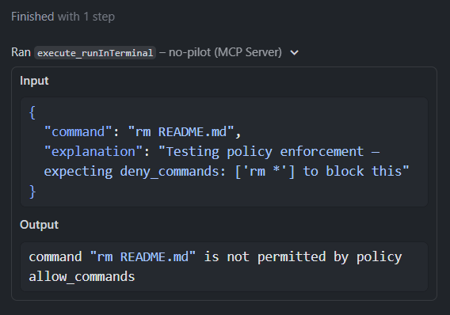

# no-pilot

Zero-trust MCP server mirroring GitHub Copilot's built-in VS Code tools, with strict policy enforcement and no cloud dependencies.

[](https://github.com/et-do/no-pilot/releases/latest)
[](https://github.com/et-do/no-pilot/actions/workflows/ci.yml)
[](LICENSE)

---

## Overview

**no-pilot** is a drop-in, zero-trust replacement for Copilot's built-in agent tools, running entirely on your infrastructure. It enforces customizable project and user policies for every tool at the system level, ensuring the agent doesn't conveniently "ignore" your prompting instructions.

- Mirrors Copilot's built-in VS Code tools (file read, directory list, search, terminal, etc.)
- Enforces deny/allow patterns from user and project config files
- No cloud, no telemetry, no sidecar—just a single binary
- Designed for teams, regulated environments, and the security conscious (or paranoid) AI Agent user



---

## Security Model

AI coding agents introduce two distinct risks. no-pilot is purpose-built to address the first; the second requires separate action on your part.

### Threat 1 — Agent over-permissioning (what no-pilot solves)

By default, Copilot's built-in tools give the agent unrestricted access to your workspace: every file, every shell command, every URL request. Because the agent interprets natural language, it can be directed — accidentally or via prompt injection — to read sensitive files, run destructive commands, or exfiltrate data through tool calls. Prompting it to "not do that" is not a reliable security control.

**no-pilot enforces policy at the tool call layer, not the prompt layer.** No matter what the agent is instructed to do, every tool invocation is checked against your policy in the MCP server before anything executes. The agent cannot talk its way past it.

| Security principle | How it is implemented |
|---|---|
| Principle of least privilege | Tools are individually controlled; disable anything the agent doesn't need with `allowed: false` |
| Zero-trust between config layers | Restrictions only tighten across user → project config; `allowed: false` is sticky |
| Fail-closed | Invalid deny patterns cause server startup failure rather than silent bypass |
| Defense in depth | Four independent enforcement layers: tool enable → path allow/deny → command allow/deny → URL deny |
| Explicit allow over implicit deny | `allow_commands` blocks everything not explicitly listed when set |
| Deny overrides allow | `deny_commands` and `deny_shell_escape` are evaluated after `allow_commands`; a denied pattern always wins |

### Layered control with VS Code Custom Agents

You can add a second control layer by using [VS Code Custom Agents](https://code.visualstudio.com/docs/copilot/customization/custom-agents) with explicit tool lists.

- **Custom Agent tools** define what the agent is *allowed to request* in a given workflow/persona.
- **no-pilot policy** defines what the MCP server will *actually execute*.

Use both together:

- Agent-level restriction reduces blast radius for day-to-day use (for example: planning agent = read/search only).
- Server-level policy in no-pilot remains the hard enforcement boundary if an agent prompt, tool list, or handoff is misconfigured.

This gives you reusable agent personas with tighter defaults while keeping zero-trust enforcement at execution time.

#### Example: create a read-only planning agent in your repo

1. Create `.github/agents/planner.agent.md`.
2. Add frontmatter with a restricted tool list.
3. Add body instructions for planning-only behavior.

```md
---
name: Planner
description: Generate implementation plans only; do not modify files.
tools: ["read/*", "search/*", "no-pilot/read_*", "no-pilot/search_*"]
---

You are a planning-only agent.

- Collect relevant code context.
- Propose a step-by-step implementation plan.
- Do not call edit or execute tools.
```

> **Important:** Custom Agent tool lists improve safety and reusability, but they are not a substitute for server-side policy. Keep no-pilot restrictions in `.no-pilot.yaml` as the authoritative control.

> **Tip:** You can create these files from VS Code with **Chat: New Custom Agent** or from the Chat Customizations editor. Workspace agents are typically stored in `.github/agents`.

#### Generate a custom agent with AI (quick path)

You can generate agents directly in chat instead of writing frontmatter by hand:

- In Agent mode, run `/create-agent` and describe the role (for example, "security review agent").
- You can also extract one from an existing conversation by asking: "make an agent for this kind of task".
- In Chat Customizations, use **Generate Agent** from the dropdown.

Reference: [VS Code Custom Agents docs](https://code.visualstudio.com/docs/copilot/customization/custom-agents).

### Threat 2 — Data leakage to cloud AI services (requires separate action)

Whether or not you use no-pilot, your code and prompts may be sent to and stored by cloud AI providers. no-pilot runs entirely locally and has no telemetry, but it does not control what Copilot itself sends upstream. Address this separately:

- **VS Code**: Settings → search `telemetry.telemetryLevel` → set to `off`
- **GitHub Copilot**: GitHub account → Settings → Copilot → opt out of "Allow GitHub to use my data for product improvements"
- **Enterprise / regulated environments**: Use GitHub Copilot Enterprise with a data residency agreement, a self-hosted model gateway, or a fully air-gapped AI solution

---

## Quick Start

<details>
<summary><strong>This Repository &mdash; VS Code Dev Container</strong></summary>

The devcontainer wires up `.vscode/mcp.json` so Copilot launches the server via `go run .` on demand — no pre-built binary required.

1. Open the repo in VS Code and click **Reopen in Container** when prompted (or run **Dev Containers: Reopen in Container** from the Command Palette).
2. Wait for the container to finish building.
3. Open the Output panel (`Ctrl+Shift+U`), select `MCP: no-pilot`, and confirm the server is running and tools are discovered.

> **Tip:** After making code changes, restart the MCP server to recompile: **Command Palette → MCP: Restart Server → no-pilot**. No `make install` needed — `go run .` uses the Go build cache and is always in sync with your source.

</details>

<details>
<summary><strong>Your own project &mdash; Dev Container integration</strong></summary>

Use this setup to add no-pilot to an **existing project** that already has (or will have) a `.devcontainer/` configuration. This installs no-pilot *inside* your project's container so it is available to Copilot without any local toolchain dependencies on the host.

> **Important:** VS Code attaches to the container and tries to start MCP servers before `postCreateCommand` finishes. If the binary is not already in the image at that point, the server fails to start. The recommended fix is to install no-pilot during the **image build** so it is always present when the container opens.

---

**Step 1 — Install no-pilot in the container image**

*Option A — Dockerfile (recommended, no timing issues)*

Add a `RUN` step to your `.devcontainer/Dockerfile`. The snippet auto-detects `amd64` vs `arm64`:

```dockerfile
RUN ARCH=$(uname -m | sed 's/x86_64/amd64/;s/aarch64/arm64/') && \
    curl -fsSL \
      "https://github.com/et-do/no-pilot/releases/latest/download/no-pilot-linux-${ARCH}" \
      -o /usr/local/bin/no-pilot && \
    chmod +x /usr/local/bin/no-pilot
```

If your `devcontainer.json` uses `"image"` rather than a Dockerfile, switch it to build from a Dockerfile first:

```json
{
  "build": { "dockerfile": "Dockerfile" }
}
```

---

*Option B — `postCreateCommand` (simpler, but requires one manual server restart)*

If you prefer not to maintain a Dockerfile, add this to your `devcontainer.json`. Note that you will need to restart the MCP server once after the container finishes setting up.

```json
{
  "postCreateCommand": "ARCH=$(uname -m | sed 's/x86_64/amd64/;s/aarch64/arm64/') && curl -fsSL \"https://github.com/et-do/no-pilot/releases/latest/download/no-pilot-linux-${ARCH}\" -o /usr/local/bin/no-pilot && chmod +x /usr/local/bin/no-pilot"
}
```

After the container build completes, run **MCP: Restart Server → no-pilot** from the Command Palette once. Subsequent container opens will find the binary already cached in the container layer.

---

**Step 2 — Add `.vscode/mcp.json` to your project**

Create (or add to) `.vscode/mcp.json` in your project root:

```json
{
  "servers": {
    "no-pilot": {
      "type": "stdio",
      "command": "/usr/local/bin/no-pilot",
      "args": []
    }
  }
}
```

Commit this file so everyone on the team gets the MCP server automatically when they open the devcontainer.

**Alternative — configure MCP directly in `devcontainer.json`**

VS Code also supports putting MCP config under `customizations.vscode.mcp` in your dev container config. This is valid for no-pilot too:

```json
{
  "customizations": {
    "vscode": {
      "mcp": {
        "servers": {
          "no-pilot": {
            "type": "stdio",
            "command": "/usr/local/bin/no-pilot",
            "args": []
          }
        }
      }
    }
  }
}
```

This only declares server configuration. The command still has to exist inside the container. You still need **Step 1** (install no-pilot in the image or via postCreateCommand).

If no-pilot is not installed in the container filesystem, startup will fail with a command-not-found/ENOENT error.

> References:
> - [Add and manage MCP servers](https://code.visualstudio.com/docs/copilot/customization/mcp-servers)
> - [MCP configuration reference](https://code.visualstudio.com/docs/copilot/reference/mcp-configuration)

---

**Step 3 — (Optional) Add a project policy file**

Create `.no-pilot.yaml` in your project root to apply project-level restrictions on top of each developer's personal config. Example for a typical web service:

```yaml
tools:
  read_readFile:
    deny_paths:
      - '**/*.key'
      - '**/*.pem'
      - '**/.env*'
      - '**/secrets/**'

  execute_runInTerminal:
    allow_commands:
      - 'go *'
      - 'make *'
      - 'git *'
      - 'npm *'
      - 'docker *'
    deny_commands:
      - 'rm -rf *'
      - 'curl * | *'
      - 'wget * | *'
    deny_shell_escape: true
```

Commit this file alongside `.vscode/mcp.json`. It is applied automatically when no-pilot starts in your workspace.

</details>

<details>
<summary><strong>Linux / macOS &mdash; from source (no container)</strong></summary>

Use this setup if you prefer to work directly in Linux or macOS without a Dev Container.

**Prerequisites:** Go 1.24+ installed and available on your `PATH`, and the repository cloned locally.

**1. Add no-pilot to VS Code MCP config**

Open (or create) `.vscode/mcp.json` in your project:

```json
{
  "servers": {
    "no-pilot": {
      "type": "stdio",
      "command": "/bin/sh",
      "args": ["-c", "cd /absolute/path/to/no-pilot && go run ."]
    }
  }
}
```

> **Important:** Use a shell wrapper (`/bin/sh -c "cd ... && go run ."`) rather than pointing directly at a pre-built binary. VS Code starts the MCP server immediately on window attach — potentially before any build scripts finish — which causes `ENOENT` errors if the binary is not yet on disk. `go run .` compiles on demand using the Go build cache and is always ready.

**2. Open the Output panel**

Press `Ctrl+Shift+U`, select `MCP: no-pilot`, and confirm the server starts and tools are discovered.

> **Tip:** After making source changes, restart the MCP server to recompile: **Command Palette → MCP: Restart Server → no-pilot**.

</details>

<details>
<summary><strong>Linux / macOS &mdash; pre-built binary</strong></summary>

**1. Download and install the binary**

```sh
# Linux (amd64)
curl -L https://github.com/et-do/no-pilot/releases/latest/download/no-pilot-linux-amd64 \
  -o ~/.local/bin/no-pilot && chmod +x ~/.local/bin/no-pilot

# Linux (arm64)
curl -L https://github.com/et-do/no-pilot/releases/latest/download/no-pilot-linux-arm64 \
  -o ~/.local/bin/no-pilot && chmod +x ~/.local/bin/no-pilot

# macOS (Apple Silicon)
curl -L https://github.com/et-do/no-pilot/releases/latest/download/no-pilot-darwin-arm64 \
  -o ~/.local/bin/no-pilot && chmod +x ~/.local/bin/no-pilot

# macOS (Intel)
curl -L https://github.com/et-do/no-pilot/releases/latest/download/no-pilot-darwin-amd64 \
  -o ~/.local/bin/no-pilot && chmod +x ~/.local/bin/no-pilot
```

If `~/.local/bin` is not on your `$PATH`, add this to your shell profile (`~/.bashrc`, `~/.zshrc`, etc.):

```sh
export PATH="$HOME/.local/bin:$PATH"
```

**2. Add no-pilot to VS Code MCP config**

Open (or create) `.vscode/mcp.json` in your project, or open the user config via `MCP: Open User Configuration` in VS Code:

```json
{
  "servers": {
    "no-pilot": {
      "command": "/home/your-username/.local/bin/no-pilot",
      "args": []
    }
  }
}
```

> **Tip:** VS Code does not expand `~` in the command path — use the full absolute path.

**3. Restart VS Code**

Open the Output panel (`Ctrl+Shift+U`), select `MCP: no-pilot`, and confirm the server starts and tools are discovered.

</details>

<details>
<summary><strong>Windows</strong></summary>

**1. Download the binary**

Open PowerShell and run:

```powershell
# Windows (amd64)
$dest = "$env:USERPROFILE\bin"
New-Item -ItemType Directory -Force -Path $dest | Out-Null
Invoke-WebRequest -Uri "https://github.com/et-do/no-pilot/releases/latest/download/no-pilot-windows-amd64" `
  -OutFile "$dest\no-pilot.exe"

# Windows (arm64)
$dest = "$env:USERPROFILE\bin"
New-Item -ItemType Directory -Force -Path $dest | Out-Null
Invoke-WebRequest -Uri "https://github.com/et-do/no-pilot/releases/latest/download/no-pilot-windows-arm64" `
  -OutFile "$dest\no-pilot.exe"
```

Then add `%USERPROFILE%\bin` to your PATH:

```powershell
[Environment]::SetEnvironmentVariable("Path", $env:Path + ";$env:USERPROFILE\bin", "User")
```

> **Note:** Restart your terminal after updating PATH for the change to take effect.

**2. Add no-pilot to VS Code MCP config**

Open (or create) `.vscode/mcp.json` in your project, or open the user config via `MCP: Open User Configuration` in VS Code:

```json
{
  "servers": {
    "no-pilot": {
      "command": "C:\\Users\\your-username\\bin\\no-pilot.exe",
      "args": []
    }
  }
}
```

**3. Restart VS Code**

Open the Output panel (`Ctrl+Shift+U`), select `MCP: no-pilot`, and confirm the server starts and tools are discovered.

> **Warning:** If you are using a **VS Code Dev Container**, do not use the Windows binary in your user-level `mcp.json`. The Windows binary cannot access container filesystem paths. Use the Dev Container setup above instead — the workspace `.vscode/mcp.json` runs the server inside the container where your files are.

</details>

---

## Policy Configuration

> [!NOTE]
> Policy configuration is optional. By default no-pilot runs with no restrictions.
> Policy file changes are hot-reloaded at runtime. Editing either user config or
> `.no-pilot.yaml` applies updated restrictions without restarting VS Code.
> Invalid `deny_paths`, `deny_commands`, and `deny_urls` patterns are rejected
> at load time (fail-closed) to avoid silent policy bypass from malformed rules.

Policies are configured via YAML files:

| Platform | User config path |
|---|---|
| Linux | `~/.config/no-pilot/config.yaml` |
| macOS | `~/Library/Application Support/no-pilot/config.yaml` |
| Windows | `%AppData%\no-pilot\config.yaml` |

Place a `.no-pilot.yaml` file in your repo root to set project-level policy. Project config is layered on top of user config — restrictions can only tighten, never loosen.

**Example:**

```yaml
tools:
  read_readFile:
    allowed: true
    deny_paths:
      - '**/secrets/**'
      - '**/*.key'

  read_listDirectory:
    allowed: true
    deny_paths:
      - '**/secrets/**'

  execute_runInTerminal:
    allowed: true
    allow_commands:
      - 'go build *'
      - 'go test *'
      - 'ls *'
    deny_commands:
      - 'rm *'
      - 'curl *'
    deny_shell_escape: true

  search_grepSearch:
    allowed: true
    deny_paths:
      - '**/secrets/**'
```

<details>
<summary><strong>Policy field reference</strong></summary>

| Field | Type | Description |
|---|---|---|
| `allowed` | bool | Set to `false` to disable the tool entirely. Defaults to `true`. |
| `deny_paths` | glob list | File path arguments matching any pattern are blocked. |
| `allow_commands` | glob list | Only commands matching a pattern are permitted (allowlist). |
| `deny_commands` | glob list | Commands matching any pattern are blocked, even if `allow_commands` permits them. |
| `deny_shell_escape` | bool | Block common interpreter invocations that accept a `-c`/`-e` flag (`bash -c`, `python -c`, `perl -e`, etc.). These can bypass `deny_commands` glob patterns by wrapping any command in a shell string. Recommended whenever `deny_commands` is set. |
| `deny_urls` | glob list | The **hostname** of URL arguments matching any pattern is blocked (web tools). |

</details>

<details>
<summary><strong>How user and project configs merge (zero-trust rules)</strong></summary>

> **Important:** These rules are designed so that restrictions can only tighten, never loosen, as configs layer on top of each other.

- **`allowed: false` is sticky** — a tool disabled at the user level cannot be re-enabled by a project config.
- **Deny lists union** — every denied path, command, or URL from every config layer accumulates.
- **Allow lists AND across layers** — a command must satisfy the allowlist from every config layer that defines one. If only one layer defines `allow_commands`, that list applies. If both layers define it, the command must match at least one pattern in each layer independently.

</details>

<details>
<summary><strong>Terminal session behavior</strong></summary>

- **`execute_runInTerminal` supports per-session context.** Use optional `cwd` to set the working directory for that session and optional `env` (newline-separated `KEY=VALUE`) to add environment entries for that session only.
- **Terminal sessions are first-class.** `execute_runInTerminal` (with `mode: 'async'` or sync timeout) returns a `terminal_id` that can be used by `execute_getTerminalOutput`, `execute_sendToTerminal`, and `execute_killTerminal`.
- **You can list active and completed sessions.** `execute_listTerminals` returns tracked sessions with id, status, command, output byte size, and optional cwd/env metadata.
- **Output reads can be sliced.** `execute_getTerminalOutput` supports optional `startOffset` and `endOffset` byte offsets for range reads over large terminal output.

</details>

<details>
<summary><strong>Known limitations</strong></summary>

- **Command matching is string-based, not executable-based.** `deny_commands: ['rm *']` blocks the string `rm -rf /`, but not `bash -c 'rm -rf /'`. Enable `deny_shell_escape: true` to block the most common `-c`/`-e` interpreter invocations. For the strictest control, disable `execute_runInTerminal` entirely with `allowed: false`.
- **`deny_urls` matches the hostname only**, not the full URL. Use patterns like `*.internal` or `169.254.*`, not `https://evil.com/bad-path*`.
- **Path deny patterns match the cleaned path.** `..` components in paths are resolved before matching, so traversal sequences cannot bypass a pattern. However, symlinks are not resolved.
- **`search_codebase` is lexical, not embedding-based.** It ranks text matches by term overlap and does not perform vector/semantic retrieval.
- **`search_usages` is textual, not language-server aware.** It finds exact symbol text matches and does not guarantee semantic definitions/references/implementations like a true IDE usage engine.
- **`web_fetch` is static (non-browser) fetching.** It supports metadata, content-type guardrails, selector-based include/exclude extraction, and HTTP cache revalidation, but it is not a headless browser and does not execute client-side JavaScript.
- **Terminal reads and follow-up execute tools only see no-pilot-managed sessions.** `read_terminalLastCommand`, `execute_getTerminalOutput`, `execute_sendToTerminal`, and `execute_killTerminal` work against terminal sessions created by `execute_runInTerminal` in this server process. They do not attach to arbitrary VS Code terminals.
- **Notebook reads are file-based, not kernel-based.** `read_getNotebookSummary` and `read_readNotebookCellOutput` inspect persisted `.ipynb` JSON on disk, including saved cell outputs, but they do not query a live notebook kernel or unsaved editor state.
- **`read_terminalSelection` is not on the standalone-server roadmap.** A standalone MCP server does not have reliable access to VS Code terminal UI selection state without editor-specific integration, so that capability belongs in a VS Code-side bridge rather than this server.

</details>

---

MIT License | © et-do
